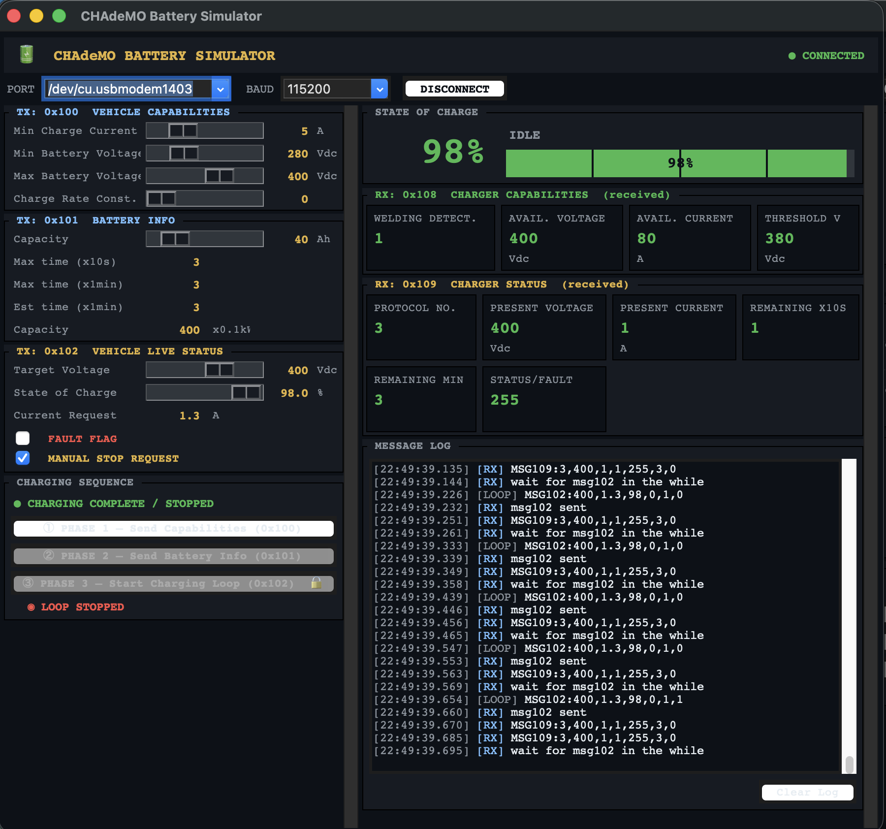
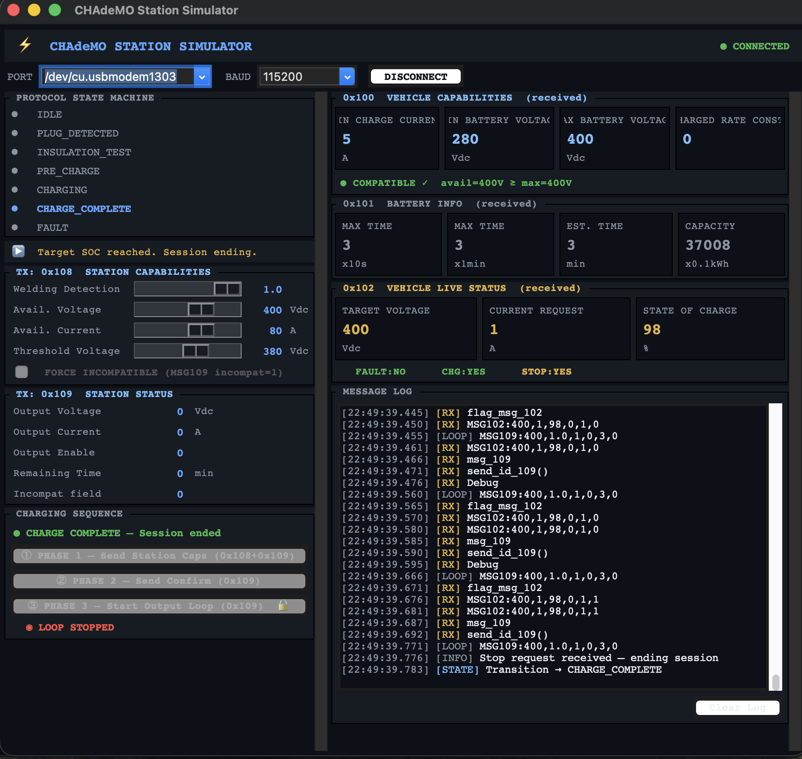
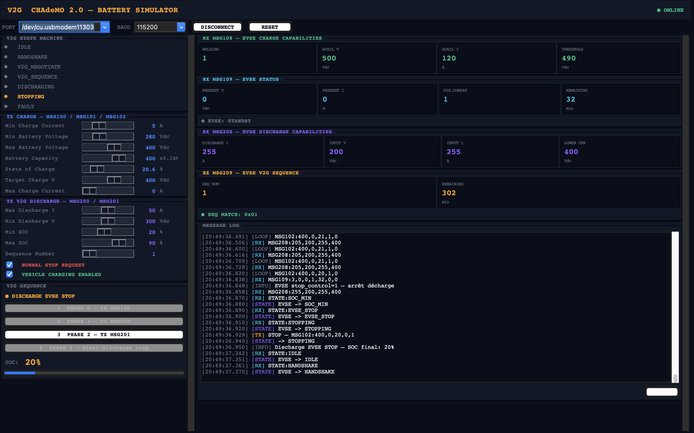
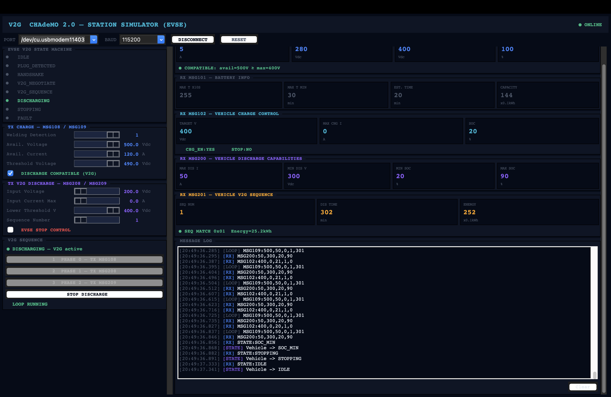

# CHAdeMO 2.0 — Charge & V2G Simulator

Implémentation complète du protocole **CHAdeMO 2.0** (charge standard + Vehicle-to-Grid) sur plateforme STM32 Nucleo, avec simulateurs Python pour le véhicule et la borne de recharge.

> Projet académique — Master 1 EEA Systèmes et Microsystèmes Embarqués  
> Université de Toulouse — 2025/2026

---

## 📋 Description

Ce projet met en œuvre la séquence de communication CHAdeMO 2.0 définie par l'**IEEE Std 2030.1.1-2021**, couvrant :

- La **charge standard** (trames CAN 0x100 / 0x101 / 0x102 / 0x108 / 0x109)
- La **décharge V2G** — Vehicle-to-Grid (trames 0x200 / 0x201 / 0x208 / 0x209)

Le système est composé de quatre composants interconnectés :

```
Battery Simulator (Python) ←── UART ──→ Battery MC (STM32)
                                               │
                                             CAN bus
                                               │
Station Simulator (Python) ←── UART ──→ Station MC (STM32)
```

---

## 🏗️ Architecture

### Composants

| Composant | Technologie | Rôle |
|---|---|---|
| **Battery Simulator** | Python / Tkinter | Simule le véhicule électrique (SOC, paramètres batterie) |
| **Station Simulator** | Python / Tkinter | Simule la borne EVSE (capacités, contrôle décharge) |
| **Battery MC** | STM32 Nucleo / HAL | Pont UART ↔ CAN côté véhicule |
| **Station MC** | STM32 Nucleo / HAL | Pont UART ↔ CAN côté borne |

### Communication

- **UART** : 115 200 baud, protocole ASCII ligne par ligne (`MSG100:...` terminé par `\n`)
- **CAN** : 500 kbps, trames standard 11 bits, interruption FIFO0
- **Cadence boucle V2G** : 100 ms

---

## 📁 Structure du dépôt

```
CHAdeMO-2.0-Charge-V2G-Simulator/
│
├── charge/                         # Mode charge standard (G2V)
│   ├── simulators/
│   │   ├── sim_battery.py          # Simulateur véhicule (charge)
│   │   ├── station_sim.py          # Simulateur borne (charge)
│   │   ├── g2v_battery_sim.png     # Capture IHM Battery Simulator
│   │   └── g2v_station_sim.png     # Capture IHM Station Simulator
│   └── firmware/
│       ├── G2V_EV_STM32/           # Projet CubeIDE Battery MC
│       └── G2V_EVSE_STM32/         # Projet CubeIDE Station MC
│
├── v2g/                            # Mode V2G — Vehicle-to-Grid
│   ├── V2G_similateur/
│   │   ├── v2g_battery_sim.py      # Simulateur véhicule (V2G)
│   │   ├── v2g_station_sim.py      # Simulateur borne (V2G)
│   │   ├── IHM_sim_battery.png     # Capture IHM Battery Simulator V2G
│   │   └── IHM_sim_station.png     # Capture IHM Station Simulator V2G
│   ├── V2G_BATTERY_STM32/          # Projet CubeIDE Battery MC (V2G)
│   └── V2G_station_STM32/          # Projet CubeIDE Station MC (V2G)
│
└── README.md
```

---

## 🔄 Séquence de communication

### Mode Charge Standard

```
Battery Sim → TX MSG100 → Battery MC → CAN 0x100 → Station MC → TX MSG100 → Station Sim
Station Sim → TX MSG108 → Station MC → CAN 0x108 → Battery MC → TX MSG108 → Battery Sim
Battery Sim → TX MSG101 (auto) → ...
Station Sim → TX MSG109 (auto) → ...
              [Boucle charge 100ms : MSG102 ↔ MSG109]
```

### Mode V2G — Phases

| Phase | Description | Messages |
|---|---|---|
| **0 — Handshake** | Identification et compatibilité | 0x100 / 0x108 / 0x101 / 0x109 |
| **1 — Négociation V2G** | Échange capacités décharge | 0x200 / 0x208 |
| **2 — Accord séquence** | Validation numéro séquence | 0x201 / 0x209 |
| **3 — Décharge** | Boucle V2G 100 ms | 0x102 + 0x200 / 0x109 + 0x208 |
| **4 — Arrêt propre** | Fin de session | stop_flag = 1 |


---

## 🖥️ Interfaces simulateurs

### Mode Charge Standard (G2V)

| Battery Simulator | Station Simulator |
|---|---|
|  |  |

### Mode V2G — Vehicle-to-Grid

| Battery Simulator V2G | Station Simulator V2G |
|---|---|
|  |  |

---

## ⚙️ Prérequis

### Simulateurs Python

```bash
pip install pyserial
```

Python 3.8+ requis. Tkinter inclus dans la plupart des distributions Python.

### Firmware STM32

- STM32CubeIDE 1.14+
- STM32CubeMX
- Carte : STM32 Nucleo-L476RG (ou compatible série L4)
- Transceiver CAN : MCP2551 ou SN65HVD230

---

## 🚀 Lancement

### 1. Flasher les firmwares

Ouvrir les fichiers `.c` dans STM32CubeIDE, les intégrer dans un projet HAL généré par CubeMX avec CAN et UART2 activés, compiler et flasher chaque Nucleo.

### 2. Câblage

```
Battery MC  CANH ──────────── CANH  Station MC
Battery MC  CANL ──────────── CANL  Station MC
Battery MC  GND  ──────────── GND   Station MC

Résistances de terminaison 120Ω aux deux extrémités du bus.
```

### 3. Lancer les simulateurs

```bash
# Terminal 1 — Battery Simulator
python v2g/v2g_battery_sim.py

# Terminal 2 — Station Simulator
python v2g/v2g_station_sim.py
```

### 4. Séquence d'utilisation

1. Connecter chaque simulateur au port COM de sa carte STM32
2. **Battery Sim** : cliquer *Phase 0* → *Phase 1* → *Phase 2* → *Phase 3*
3. **Station Sim** : répondre à chaque phase au fur et à mesure
4. Observer la décroissance du SOC et les échanges de trames en temps réel
5. Cliquer *RESET* pour réinitialiser le système sans redémarrer les MCU

---

## 📡 Protocole UART

### Format des messages

Toutes les trames UART sont en ASCII, terminées par `\n` :

```
MSG100:min_i,min_v,max_v,charge_rate
MSG101:max_t10s,max_t1min,est_t,capacity
MSG102:target_v,max_chg_i,soc,chg_en,stop_flag
MSG108:welding,avail_v,avail_i,threshold_v
MSG109:protocol,pres_v,pres_i,dis_compat,status,rem_10s,rem_1min
MSG200:max_dis_i,min_dis_v,min_soc,max_soc
MSG201:seq_num,dis_time,energy
MSG208:dis_i_offset,input_v,input_i_offset,lower_thr
MSG209:seq_num,remaining_min
STATE:HANDSHAKE | V2G_NEGOTIATE | V2G_SEQUENCE | DISCHARGING | STOPPING | IDLE
RESET
```

### Encodage des courants V2G

Les courants dans les trames 0x200 et 0x208 sont encodés en **offset inverse** :

```
valeur_CAN = 0xFF - courant_amperes
0xFF → 0 A    (courant nul)
0x00 → 255 A  (courant maximal)
```

---

## 🔋 Simulation de la décharge

La décroissance du SOC suit la formule :

```
ΔSOC = (I_décharge / C_batterie) × (100 / 3600) × dt × k_accél
```

| Paramètre | Valeur par défaut | Description |
|---|---|---|
| I_décharge | 50 A | Courant de décharge |
| C_batterie | 400 (×0,1 kWh) | Capacité = 40 kWh |
| dt | 0,1 s | Période de tick |
| k_accél | 600 | Facteur d'accélération simulation |
| **ΔSOC/tick** | **≈ 0,208 %** | Décroissance par tick |
| **Durée 80→20%** | **≈ 29 s réelles** | = 3 min simulées |

---

## 🛠️ Points techniques notables

### Gestion non-bloquante en Phase 3

En boucle de décharge, le Station MC utilise une vérification non-bloquante pour les réponses UART afin d'éviter tout deadlock :

```c
// Non-bloquant : ne pas attendre indéfiniment MSG109
if (rx_line_ready) {
    // traiter MSG109 / MSG208
}
// Continuer la boucle même si pas de réponse encore
```

### Flush des flags CAN avant Phase 3

La trame CAN 0x109 du handshake contient `stop_control = 1` dans son byte de status. Ce flag résiduel est purgé avant d'entrer en décharge :

```c
evse_stop_control = 0;
flag_msg_109      = 0;  // flush trame résiduelle
flag_msg_208      = 0;
```

### Reset système

La trame CAN `0x7FF` déclenche un reset global des deux MCU via `HAL_NVIC_SystemReset()`, sans débrancher le bus.

---

## 📊 Résultats

- Latence bout-en-bout (Sim → MC → CAN → MC → Sim) : **< 20 ms** dans 95 % des cas
- Boucle de décharge stable à **100 ms** sur toute la durée de session
- Trois conditions d'arrêt validées : SOC minimum, timeout 3 min, stop manuel
- Reset fonctionnel sans redémarrage des microcontrôleurs

---

## 📚 Références

- IEEE Std 2030.1.1-2021 — *Standard for DC Quick and Bi-directional Charging of Plug-In Electric Vehicles*
- CHAdeMO Association — [chademo.com](https://www.chademo.com)
- STM32 HAL Documentation — [st.com](https://www.st.com)

---

## 👤 Auteur

**Bocar Kante**  
Master 1 EEA — Systèmes et Microsystèmes Embarqués  
Université de Toulouse  
[github.com/bocarknt](https://github.com/bocarknt)

---

## 📄 Licence

Ce projet est à usage académique. Libre de réutilisation avec attribution.
